<div align="center">

# 🛡️ Jaafar Trabelsi — Cybersecurity Portfolio

A modern, animated personal portfolio for a cybersecurity student & software engineer.
Dual-theme (red ⇄ green), fully responsive, and built from scratch with vanilla web tech.

**🌐 Live demo: [jaafar-trabelsi-portfolio.netlify.app/](https://jaafar-trabelsi-portfolio.netlify.app/)**

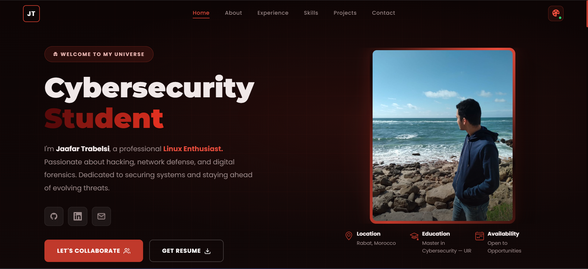

</div>

---

## ✨ Features

- 🎨 **Two switchable color themes** — toggle between a red and a green palette; the choice is saved in `localStorage` and applied before first paint (no color flash on reload).
- 💻 **Animated terminal preloader** — a "Portfolio Terminal" boot sequence on first load.
- ⌨️ **Typewriter hero** — rotating roles (CTF Player, Ethical Hacker, Pentester, Linux Enthusiast, …).
- 🖼️ **Profile card with a rotating glow border** — animated gradient frame around the photo (respects `prefers-reduced-motion`).
- 🧭 **Sticky navbar** with smooth scrolling and active-section highlighting.
- 🧱 **Rich sections** — Home, About, Experience (timeline + stats), Skills (tabs, tech marquee & 3D cube), Projects, Contact.
- 📨 **Working contact form** powered by EmailJS.
- 📱 **Fully responsive** — tuned for desktop, tablet, and mobile with no horizontal overflow.
- ⚡ **No framework, no build step** — just HTML, CSS, and JavaScript.

---

## 🎨 Dual Theme

The palette switch lives in the navbar (the 🎨 icon). Every section, accent, glow, and gradient re-colors instantly.

| 🔴 Red (default) | 🟢 Green |
| :---: | :---: |
|  | 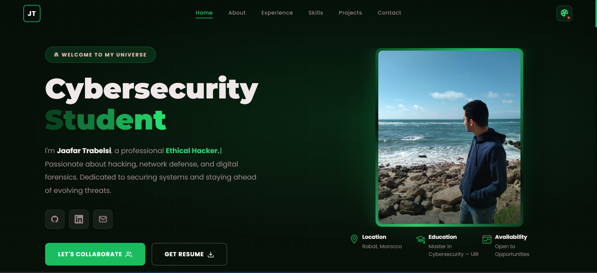 |

---

## 📸 Screenshots

<details open>
<summary><b>🏠 Home</b></summary>

| Red | Green |
| :---: | :---: |
|  |  |

</details>

<details>
<summary><b>👤 About</b></summary>

| Red | Green |
| :---: | :---: |
| 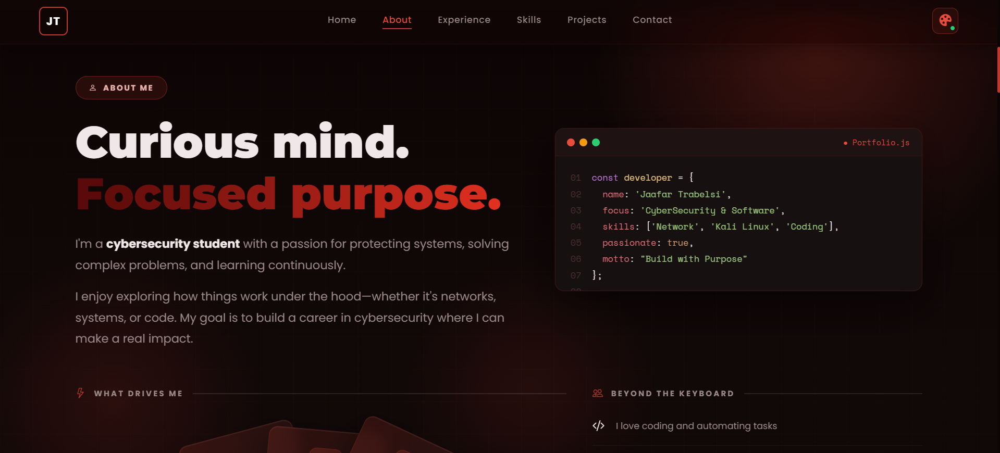 | 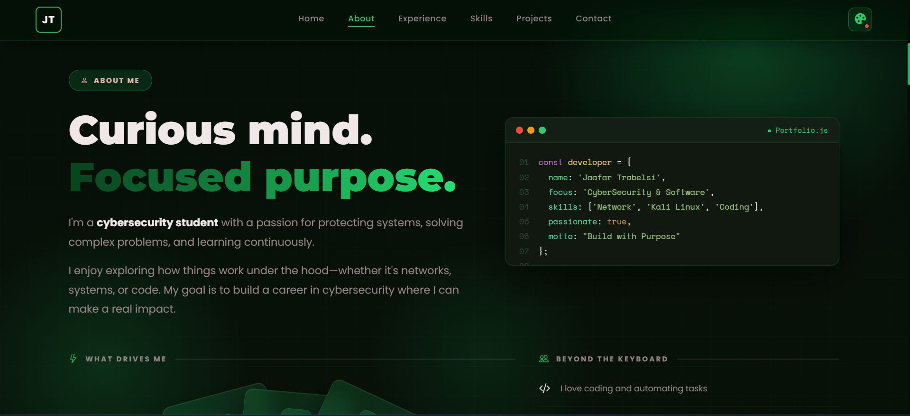 |
| 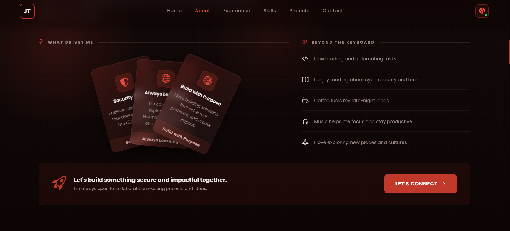 | 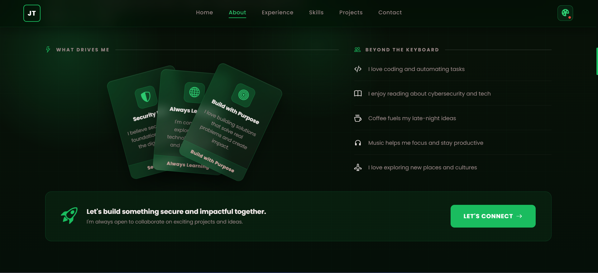 |

</details>

<details>
<summary><b>💼 Experience</b></summary>

| Red | Green |
| :---: | :---: |
| 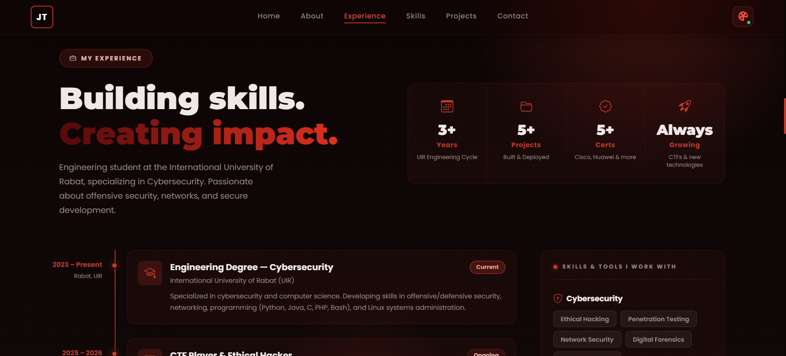 | 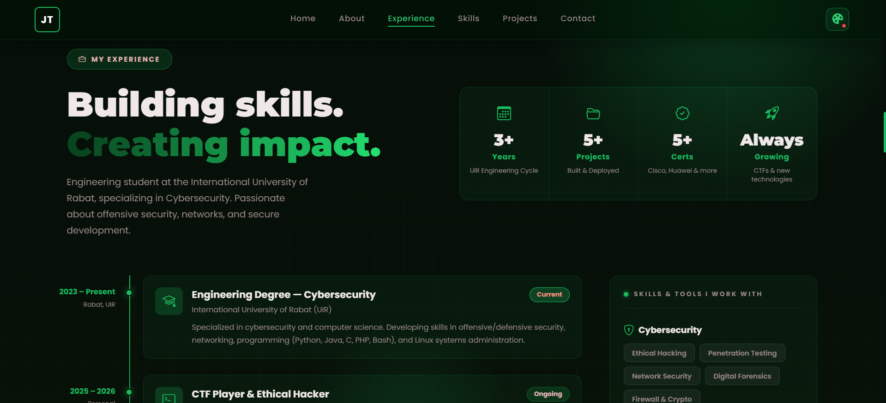 |
| 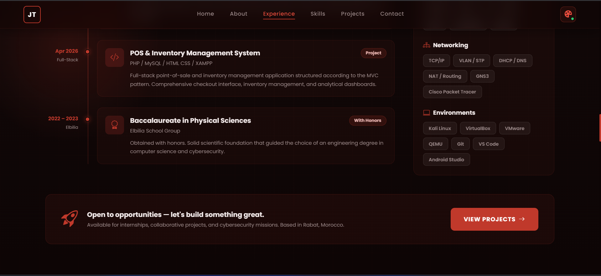 | 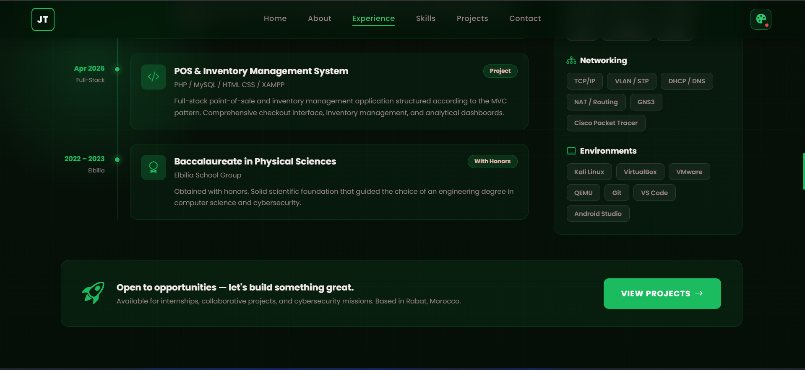 |

</details>

<details>
<summary><b>🧠 Skills</b></summary>

| Red | Green |
| :---: | :---: |
| 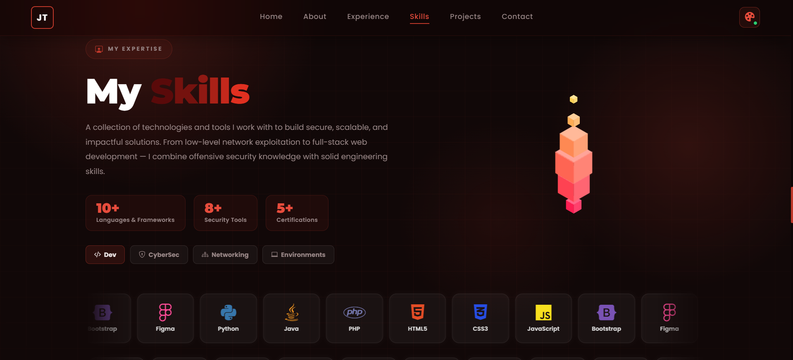 | 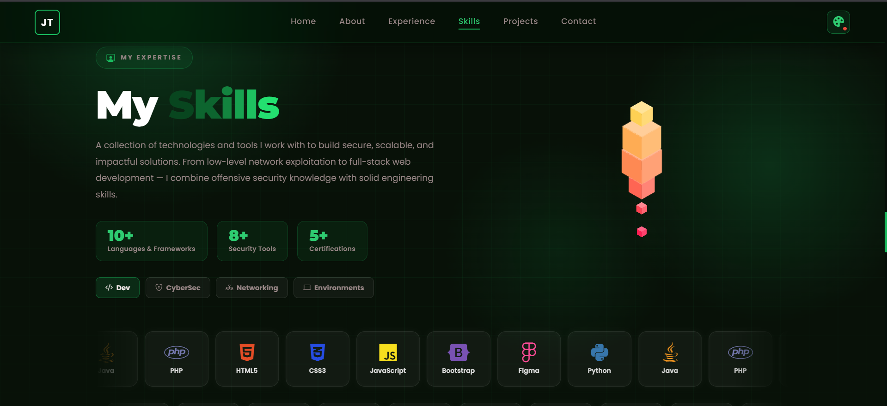 |

</details>

<details>
<summary><b>🚀 Projects</b></summary>

| Red | Green |
| :---: | :---: |
| 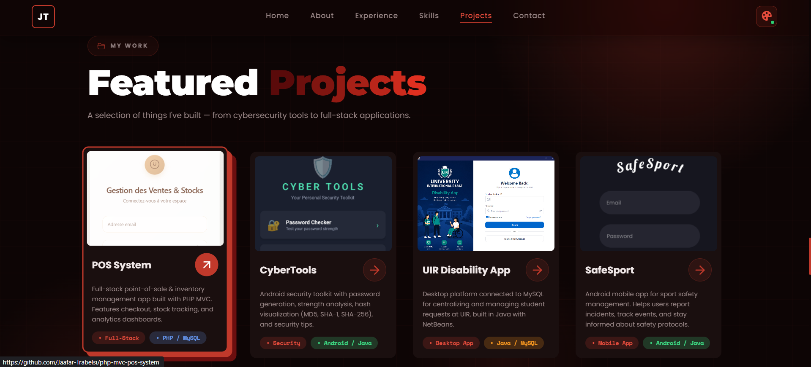 | 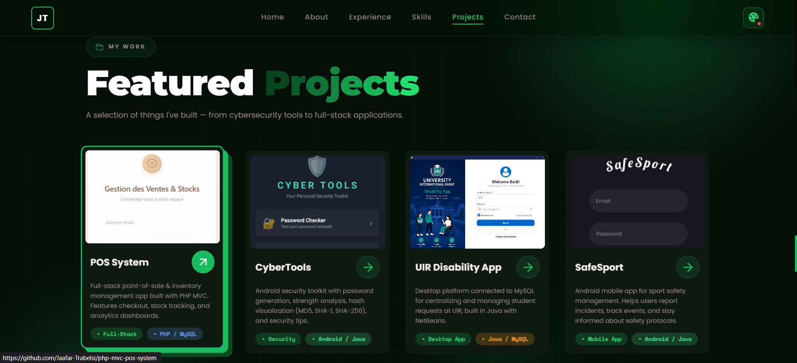 |
| 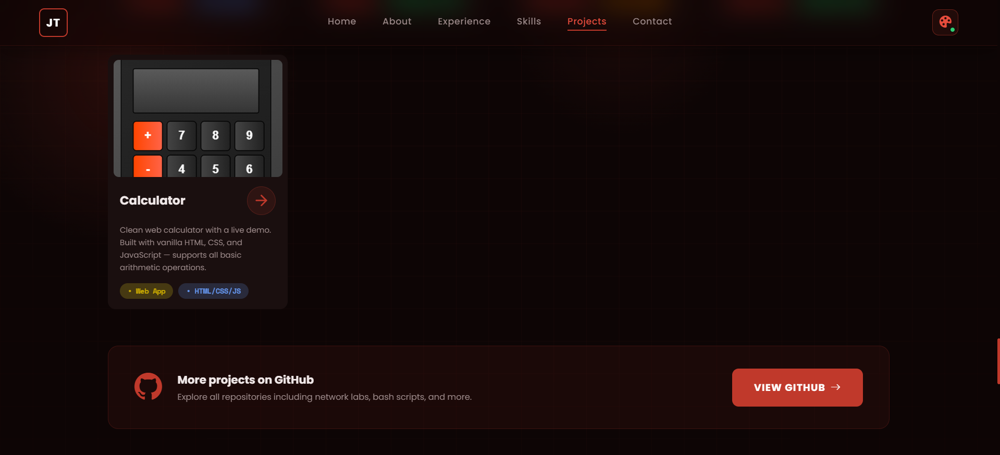 | 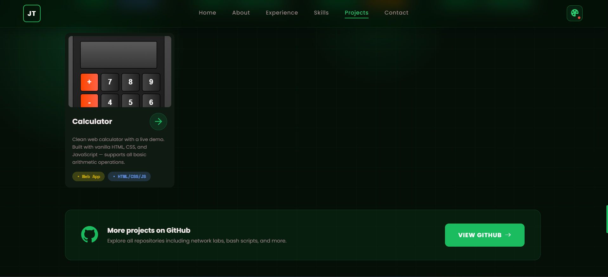 |

</details>

<details>
<summary><b>📬 Contact</b></summary>

| Red | Green |
| :---: | :---: |
| 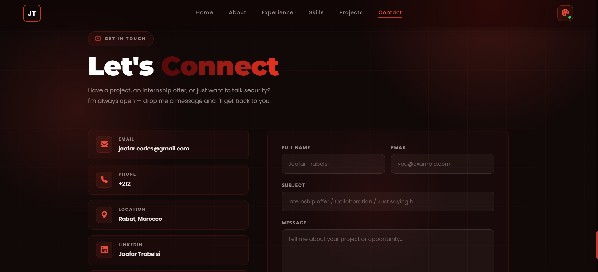 | 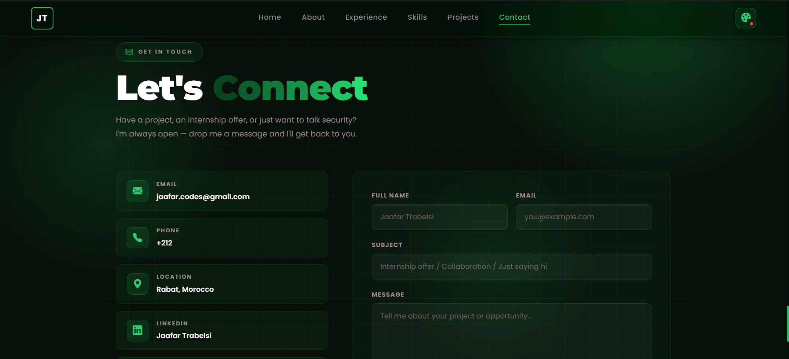 |
| 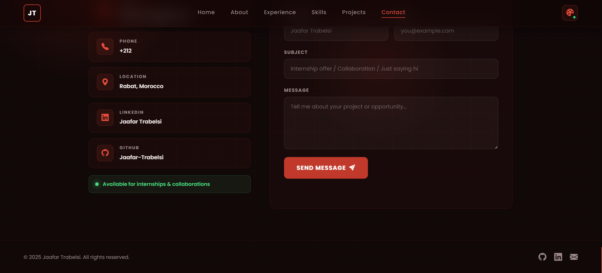 | 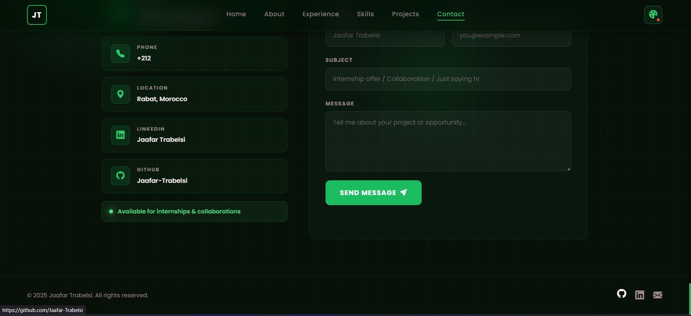 |

</details>

---

## 🛠️ Tech Stack

| Category | Tools |
| --- | --- |
| **Markup & Styling** | HTML5, CSS3 (Flexbox, Grid, custom properties, animations) |
| **Scripting** | Vanilla JavaScript (ES6+) |
| **Forms** | [EmailJS](https://www.emailjs.com/) |
| **Icons** | Bootstrap Icons, Font Awesome |
| **Fonts** | Poppins, Montserrat, Space Mono (Google Fonts) |
| **Hosting** | Netlify |

---

## 📁 Project Structure

```
.
├── CV-Trabelsi-Jaafar.pdf  # Downloadable resume
└── Readme-img/             # Screenshots used in this README
```

## 📬 Contact

- 📧 **Email:** jaafar.codes@gmail.com
- 💼 **LinkedIn:** [Jaafar Trabelsi](https://www.linkedin.com/in/jaafar-trabelsi-557761217/)
- 🐙 **GitHub:** [@Jaafar-Trabelsi](https://github.com/Jaafar-Trabelsi)
- 📍 **Location:** Rabat, Morocco

---

<div align="center">

© 2026 Jaafar Trabelsi. All rights reserved.

<i>Open to internships, collaborative projects, and cybersecurity missions.</i>

</div>
